# 气象大数据采集、分析与可视化系统课程设计报告

## 摘要

本课程设计实现面向唐山、北京、上海三站的气象大数据采集、存储、分析与可视化系统。唐山站由 ESP32-WROVER-E 与 DHT11 组成自动气象站，采集真实温湿度；北京、上海站以 Open-Meteo 当前气象数据叠加小幅扰动形成连续实时数据。三站经 WebSocket 推送至采集服务器，实时数据写入 HBase，批量数据写入 HDFS。Hive 在 HDFS 之上建立外部表，Spark on YARN 完成站点统计、日统计、小时序列与 10 秒窗口均值计算。可视化层以 FastAPI、Next.js 与 Recharts 替换 MTAS 与 ECharts，提供总览、详情与对比分析三个页面。系统打通从传感器采集到浏览器可视化的完整流程，并通过 HBase、HDFS、Hive、Spark 与前端页面的联合验证。

**关键词**：气象大数据；DHT11；HBase；Spark；数据可视化

## 目录

Word 版本使用自动目录生成。本 Markdown 草稿按课程指导文档的实现流程组织：系统简介、环境搭建、数据采集与传输、数据存储、数据分析与处理、数据可视化、系统集成与测试、改进与加分项说明、结论，以及致谢、心得体会、参考文献和附录。

## 1. 系统简介

本系统是一个面向唐山、北京、上海三站的气象大数据采集、存储、分析与可视化系统，覆盖温湿度传感器采集、Wi-Fi 数据传输、HDFS 与 HBase 存储、Hive 数据仓库、Spark on YARN 分析与 Web 可视化展示。唐山站为硬件演示站，由 ESP32-WROVER-E 与 DHT11 组成自动气象站；北京、上海为对比站，以 Open-Meteo 数据形成连续实时输入。

三站的数据来源如下：

| 站点 | 作用 | 实时数据来源 | 历史数据来源 |
|---|---|---|---|
| 唐山 | 硬件演示站 | ESP32 + DHT11 采集温湿度，Open-Meteo 补齐气压、风速、风向和天气码 | Open-Meteo Archive API |
| 北京 | 对比站 | Open-Meteo 当前值 + 小幅扰动 | Open-Meteo Archive API |
| 上海 | 对比站 | Open-Meteo 当前值 + 小幅扰动 | Open-Meteo Archive API |

### 1.1 系统架构

系统整体架构为“自动气象站 → 数据采集服务器 → HBase/HDFS → Hive/Spark → 可视化”，如下图所示：


图 1-1 系统整体架构

各部分职责：自动气象站负责采集与序列化；数据采集服务器反序列化后将实时数据写入 HBase、批量数据写入 HDFS；分布式系统部署 HDFS、HBase、Hive、Spark 与 Web 服务；终端用户通过浏览器查看实时数据与分析结果。

## 2. 环境搭建

### 2.1 硬件环境

唐山自动气象站由 ESP32-WROVER-E 开发板和 DHT11 温湿度传感器组成，两者插在面包板上通过杜邦线连接。ESP32-WROVER-E 搭载乐鑫 ESP32 芯片，集成 2.4 GHz Wi-Fi 与双核处理器，支持 MicroPython 固件。开发板通过 USB 连接电脑，用于供电、刷写程序和串口调试；DHT11 通过 VCC、GND 和 DATA 三线连接 ESP32。

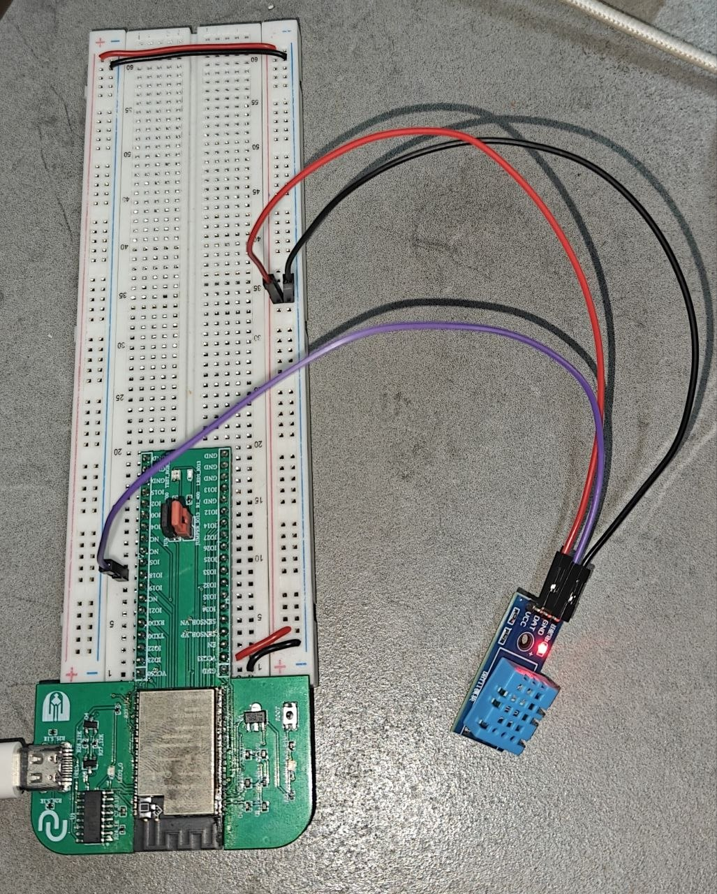

图 2-1 ESP32 与 DHT11 温湿度传感器实物连接

实物连接关系如下：

| DHT11 模块 | ESP32 |
|---|---|
| VCC | 3.3V |
| GND | GND |
| DATA | GPIO18 |

板载 `main.py` 中 `DHT_PIN = 18`，与接线一致；DHT11 模块指示灯点亮，说明供电正常。ESP32 运行 MicroPython 程序，每秒读取一次温湿度，并通过 Wi-Fi 推送至采集服务器。运行时日志显示唐山站连接到采集服务器 `10.167.143.18:8080`，ESP32 自身获得的局域网地址为 `10.167.143.124`，硬件接线、板载程序与串口日志相互印证。

### 2.2 软件环境

本系统使用的主要软件环境如下：

| 类别 | 使用组件 |
|---|---|
| 单片机端 | MicroPython、`machine.Pin`、`dht.DHT11`、`socket`、`ujson` |
| 数据采集服务 | Python、`websockets`、HappyBase |
| 分布式存储 | HDFS、HBase、HBase Thrift |
| 数据仓库 | Hive 外部表 |
| 数据处理 | Spark 3.5.1、YARN、PySpark |
| Web API | FastAPI、Uvicorn |
| 前端 | Next.js、Bun、Recharts、shadcn/ui 风格组件 |
| 数据来源 | Open-Meteo Forecast API、Open-Meteo Archive API |

大数据服务运行在本机的 `ubuntu22` distrobox 环境中，项目脚本生成独立的 Hadoop、HBase、Spark runtime 配置，与宿主环境隔离。

### 2.3 一键启动流程

系统提供 `scripts/start-all.sh` 作为一键启动入口，支持启动、停止、重启和状态查询：

```bash
./scripts/start-all.sh
./scripts/start-all.sh status
./scripts/start-all.sh stop
./scripts/start-all.sh restart
```

脚本默认端口如下，均可通过环境变量覆盖：

| 服务 | 环境变量 | 默认端口 |
|---|---|---:|
| FastAPI | `API_PORT` | 8008 |
| Next.js | `PORT` | 3000 |
| 采集 WebSocket Server | `WS_PORT` | 8080 |
| Spark 分析常驻服务 | `SPARK_SERVER_PORT` | 18081 |
| HBase Thrift | - | 9090 |

启动顺序与依赖关系如下图所示：

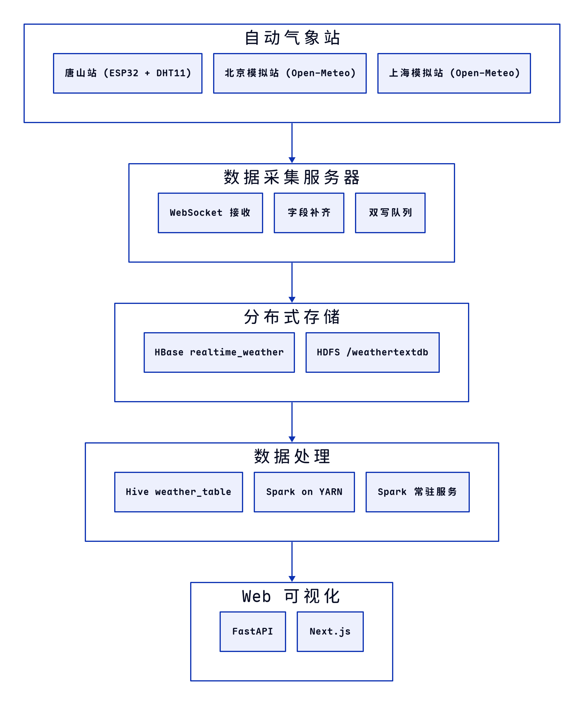

图 2-2 一键启动顺序与数据依赖

脚本在 HDFS safe mode 关闭、HBase Thrift 可连接、采集服务器端口监听、Spark 服务健康检查通过等关键节点等待确认后再执行下一步，避免上层服务在底层数据组件未就绪时启动失败。各服务日志统一写入 `.runtime/all/logs/`，便于排查启动异常。

启动流程末尾自动触发一次 Spark 重算，由 `RUN_SPARK_ON_START=1` 开启；FastAPI 就绪后脚本自动请求一次重算，不阻塞前端启动：

```bash
RUN_SPARK_ON_START=1 ./scripts/start-all.sh
```

运行时也可通过对比分析页的“手动刷新”按钮触发重算，二者调用同一个 Spark 常驻服务。

ESP32 程序上传由 `scripts/upload-esp32-weatherstation.sh` 单独完成，不纳入一键脚本。实物 DATA 接 GPIO18，上传命令通过环境变量传入引脚号、热点凭据与采集服务器地址：

```bash
ESP32_DHT_PIN=18 \
ESP32_SSID=prometheus \
ESP32_WIFI_KEY=<热点密码> \
ESP32_SERVER_HOST=10.167.143.18 \
ESP32_SERVER_PORT=8080 \
./scripts/upload-esp32-weatherstation.sh
```

## 3. 数据采集与传输

### 3.1 自动气象站采集

唐山站负责真实温湿度采集。自动气象站以 ESP32-WROVER-E 为核心，通过 DHT11 每秒读取一次温湿度，经 Wi-Fi 推送至采集服务器。采集程序完成三步：连接指定热点，初始化 DHT11 并读取温湿度，建立 WebSocket 连接后每秒发送一条 JSON 记录。

MicroPython 没有现成的 WebSocket 客户端库，采集程序用 `socket` 手工完成 WebSocket 握手与文本帧发送。握手阶段发送 HTTP `Upgrade: websocket` 请求，待服务器返回 `101 Switching Protocols` 后进入 WebSocket 通信；发送文本帧时按协议对客户端 payload 加 4 字节 mask。握手与帧发送的核心代码如下：

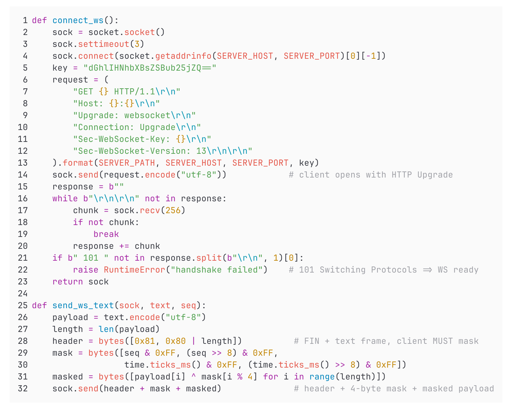

图 3-1 ESP32 WebSocket 握手与文本帧发送

选择手写 WebSocket 而非引入客户端库，是为了在 MicroPython 环境中保持依赖简单、固件体积小；mask 使用样本号与 `time.ticks_ms()` 生成，既能满足协议对客户端帧的掩码要求，又顺带携带采样序号信息，避免额外字段。服务器端 `websockets` 库按标准客户端帧解析，双方握手与传输均正常。

每条记录携带站点 ID、站点名、温度、湿度与递增样本号 `sample_seq`：

```json
{
  "station_id": "tangshan",
  "station_name": "唐山",
  "temperature": 24,
  "humidity": 36,
  "sample_seq": 137
}
```

`sample_seq` 为 ESP32 端递增样本号，用于验证数据来自连续实时采样。DHT11 为低成本温湿度传感器，用于真实温湿度采集演示；其读数精度有限，仅作为实时采集链路证据，不作为高精度气象观测。

### 3.2 三站统一 WebSocket 接入

本系统采用 WebSocket Client 主动推送的接入方式：各站点作为 WebSocket Client 主动连接采集服务器，采集服务器作为 WebSocket Server 监听 `0.0.0.0:8080` 统一接收。相比由服务器反向连接站点的方式，主动推送不依赖站点的实时 IP，热点分配地址变化时仍可接入。三站接入协议统一，采集服务器按同一套逻辑解析、补齐、入队与写入。

唐山站由 ESP32 担任 WebSocket Client；北京、上海站由 Open-Meteo 模拟客户端担任。Open-Meteo 是免费的开放气象数据 API，提供全球站点的历史与实时气象预报数据，无需密钥即可调用。本系统使用其 Forecast API 获取当前天气基准值，使用 Archive API 获取历史小时数据。北京、上海站每秒推送一次数据，先从 Open-Meteo 当前天气接口获取真实基准值，再叠加小幅扰动，使曲线在短时间内连续变化。扰动范围如下：

| 字段 | 扰动范围 |
|---|---:|
| 温度 | ±0.3 摄氏度 |
| 湿度 | ±2% |
| 气压 | ±0.5 hPa |
| 风速 | ±0.5 m/s |
| 风向 | ±5 度 |

天气码保留 Open-Meteo 当前天气码，不做随机替换。

### 3.3 统一数据模型

采集服务器将三站数据归并为统一九列气象记录：

```csv
collect_time,station_id,station_name,temperature,humidity,pressure,wind_speed,wind_direction,weather_code
```

字段含义如下：

| 字段 | 含义 | 单位 |
|---|---|---|
| `collect_time` | 采集时间，使用 Asia/Shanghai 时区 | - |
| `station_id` | 站点 ID | `tangshan` / `beijing` / `shanghai` |
| `station_name` | 站点中文名 | 唐山 / 北京 / 上海 |
| `temperature` | 温度 | 摄氏度 |
| `humidity` | 相对湿度 | % |
| `pressure` | 地面气压 | hPa |
| `wind_speed` | 10 米风速 | m/s |
| `wind_direction` | 10 米风向 | 度 |
| `weather_code` | 天气代码 | Open-Meteo WMO weather code |

唐山站硬件只提供温度和湿度，采集服务器使用 Open-Meteo 当前值补齐气压、风速、风向和天气码。这样既保留真实硬件采集，又保证三站记录结构一致，便于 HDFS、Hive、Spark 和前端统一处理。

## 4. 数据存储

采集服务器收到三站推送后，将实时数据写入 HBase、批量数据写入 HDFS，二者按职责分工：HBase 存放短期实时数据供前端当前读数与近 150 秒趋势查询，HDFS 存放批量数据供 Hive 与 Spark 分析。

### 4.1 采集服务器

采集服务器作为 WebSocket Server 接收三站消息，完成字段补齐与并行写入。为避免存储写入阻塞 WebSocket 接收，服务器将实时写入与批量归档分离，内部结构如下图所示：

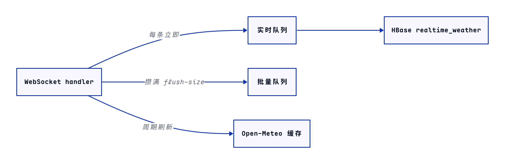

图 4-1 采集服务器内部结构

WebSocket handler 只负责解析消息、补齐字段与入队，不直接触碰 HBase 或 HDFS。实时队列收到记录后尽快写入 HBase；批量队列按 `flush-size` 聚合后写入 HDFS；Open-Meteo 当前值按固定周期刷新缓存，避免每条数据都请求外部 API。

实时与批量分离的关键在于 HBase 与 HDFS 的写入速率差异。HBase 通过 Thrift 批量 put，能承载三站每秒共 3 条的写入节奏；HDFS 每次写入都要经过 NameNode 协调与 `hdfs dfs -put` 落盘，单条写入延迟远高于 HBase，若按 HBase 的频率同步写 HDFS，写入速度跟不上到达速度，数据会在内存中积压。因此实时数据每条立即入 HBase 队列，HDFS 侧则攒满 `flush-size`（默认 30 条，约 10 秒一个批次）再一次性 put，使 HDFS 的写入节奏与其吞吐能力匹配。

服务器收到 JSON 消息后统一转换为内部记录，并在接收时刻生成 `collect_time`。若消息缺少气压、风速、风向或天气码，从 Open-Meteo 当前值缓存补齐并加小范围扰动，使唐山站也进入九列统一模型。

### 4.2 HBase 实时存储

HBase 用于短期实时数据存储，列族 TTL 设为 150 秒，旧记录自动过期，避免实时表无限增长。建表与批量写入的核心代码如下：

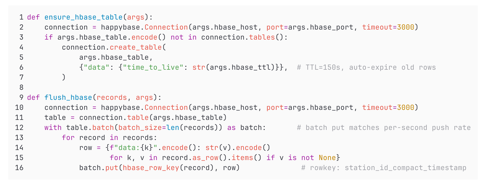

图 4-2 HBase 建表与批量写入

表结构如下：

| 项目 | 设计 |
|---|---|
| 表名 | `realtime_weather` |
| 列族 | `data` |
| TTL | 150 秒 |
| 行键 | `<station_id>_<collect_time_compact>` |
| 写入方式 | HappyBase Thrift batch put |

列包括 `data:collect_time`、`data:station_name`、`data:temperature`、`data:humidity`、`data:pressure`、`data:wind_speed`、`data:wind_direction`、`data:weather_code` 与 `data:sample_seq`。

行键格式为 `station_id + 紧凑时间戳`，例如 `tangshan_202606252214...`，使同一站点的实时数据天然按时间排列。前端查询详情页时以 `row_prefix=tangshan_` 扫描唐山站最近数据，再按最新时间向前截取 150 秒窗口，无需读取后排序。

采集服务器采用双写方式：不用 HDFS 承担实时查询，也不让 HBase 承担长期分析。

### 4.3 HDFS 批量存储

HDFS 保存历史数据与实时批次文件，均存放于 `/weathertextdb` 目录：历史数据主文件 `weather_observations.csv`，实时批次文件 `live_*.csv`。实时批次由采集服务器按 `flush-size` 聚合后写入，攒批与分发逻辑的核心代码如下：

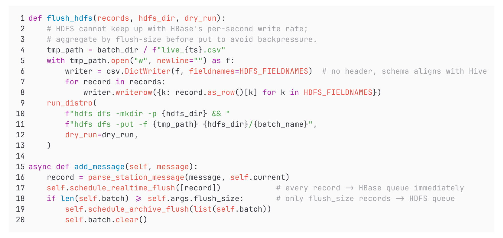

图 4-3 HDFS 攒批写入与双写分发

三站每秒推送时约每 10 秒产生一个批次；批次文件不写表头，字段顺序与 Hive 外部表一致，便于 Spark 按固定 schema 读取。`add_message` 中每条记录立即进入 HBase 队列，仅当批次攒满 `flush_size` 才进入 HDFS 队列，正是上一节速率差异的处理落地。

历史数据为 1008 条小时记录，范围 2026-06-11T00:00 至 2026-06-24T23:00，三站各 336 条，作为 Spark 历史分析的基线。实时批次与历史主文件同处一目录，Hive 外部表即可同时覆盖历史与实时数据。

## 5. 数据分析与处理

历史与实时数据落入 HDFS 后，由 Hive 建立数据仓库，由 Spark on YARN 完成统计分析，结果供前端可视化消费。

### 5.1 Hive 外部表

Hive 在 HDFS 的 CSV 文件之上建立外部表 `weather_table`，位置为 `/weathertextdb`，使历史主文件与实时批次文件统一纳入一张表。表结构如下：

```sql
CREATE EXTERNAL TABLE weather_table (
  collect_time STRING,
  station_id STRING,
  station_name STRING,
  temperature DOUBLE,
  humidity DOUBLE,
  pressure DOUBLE,
  wind_speed DOUBLE,
  wind_direction DOUBLE,
  weather_code INT
)
ROW FORMAT DELIMITED
FIELDS TERMINATED BY ','
LOCATION '/weathertextdb';
```

相比基础七列格式，本表增加 `station_id` 与 `weather_code`：`station_id` 供接口与前端稳定筛选站点，`weather_code` 供前端天气标签与图标映射。

### 5.2 Spark on YARN 分析

Spark 以 Hive 表为输入，在 YARN 上完成四项分析，结果写入 HDFS 的 `/weather_analysis/` 并同步为本地 JSON 供 API 读取：

| 输出 | 说明 |
|---|---|
| `station_summary` | 三站统计摘要 |
| `daily_summary` | 三站逐日统计 |
| `hourly_series` | 历史小时序列 |
| `window_mean` | 10 秒窗口均值序列 |

统计摘要字段包括记录数、平均温度、最低温度、最高温度、平均湿度、平均气压、平均风速、气压变化量、最大风速与主导风向。其中主导风向不取简单算术平均，而是将风向角转换为正弦、余弦分量做向量平均，避免 359° 与 1° 被错误平均为 180°。核心代码如下：

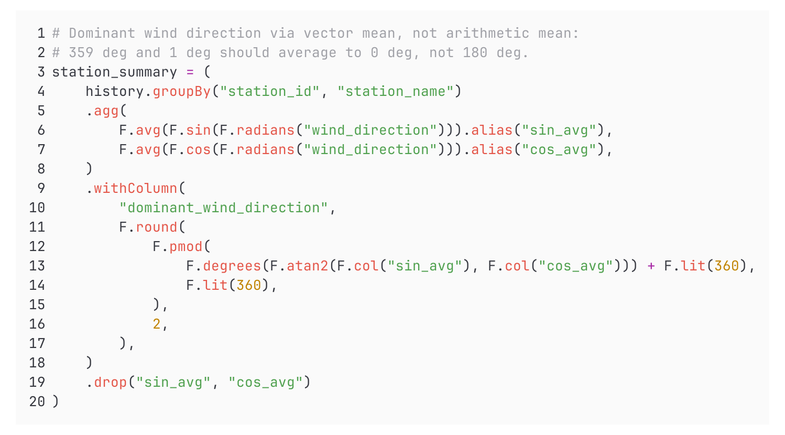

图 5-1 主导风向的向量平均计算

当前历史数据统计摘要如下：

| 站点 | 记录数 | 平均温度 | 最低温度 | 最高温度 | 平均湿度 | 平均气压 | 平均风速 | 气压变化量 | 最大风速 | 主导风向 |
|---|---:|---:|---:|---:|---:|---:|---:|---:|---:|---:|
| 北京 | 336 | 25.08 | 16.70 | 33.30 | 62.20 | 1001.42 | 1.74 | 11.70 | 4.58 | 79.14 |
| 上海 | 336 | 24.66 | 19.60 | 34.50 | 80.98 | 1007.41 | 2.50 | 13.30 | 5.01 | 94.74 |
| 唐山 | 336 | 23.12 | 15.70 | 30.10 | 72.84 | 1003.41 | 2.23 | 10.00 | 5.61 | 154.66 |

10 秒窗口均值是分析的重点：将 `collect_ts` 按指定秒数分桶，按站点与时间窗口分组对各气象要素取均值，再将窗口起点还原为可读时间，实现秒级高频数据到 10 秒粒度趋势的降采样。核心代码如下：

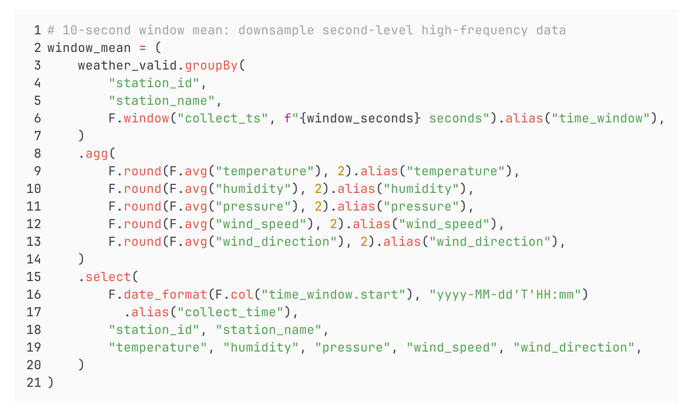

图 5-2 10 秒窗口均值聚合

### 5.3 Spark 常驻服务

系统设置 Spark 常驻分析服务，托管 SparkSession 并复用同一个 YARN application，避免每次重算都重新提交作业。前端对比分析页的“手动刷新”按钮经 FastAPI 调用常驻服务触发重算；刷新期间旧 JSON 缓存继续对外提供数据，Spark 完成后再替换为最新结果，页面不会因作业运行而空白。

常驻服务提供 `/health`、`/status` 与 `/refresh` 三个接口。每次刷新在后台线程执行，状态与日志供前端轮询，前端据 `progress_percent`、`application_id`、`exit_code` 等字段渲染进度条与日志尾部。

本次运行中，历史小时数据 1008 条，实时与历史合计有效记录 23235 条；刷新完成后生成 3 行站点摘要、42 行日统计、1008 行小时序列与 1425 行 10 秒窗口均值。Spark 分析既覆盖历史批处理，也把实时批次纳入短窗口均值计算。

## 6. 数据可视化

可视化层将 HBase 的实时数据与 Spark 的分析结果呈现到浏览器。系统以 FastAPI 提供结构化 REST API，以 Next.js + Recharts 实现前端页面，二者独立运行：FastAPI 只负责数据接口，前端单独构建与部署。

### 6.1 FastAPI 接口

接口按数据来源分为两类：实时数据直接读取 HBase Thrift；分析数据读取 Spark 生成的本地 JSON 缓存；实时批次记录通过 `hdfs dfs` 读取 HDFS 中的 `live_*.csv`。主要接口定义如下：

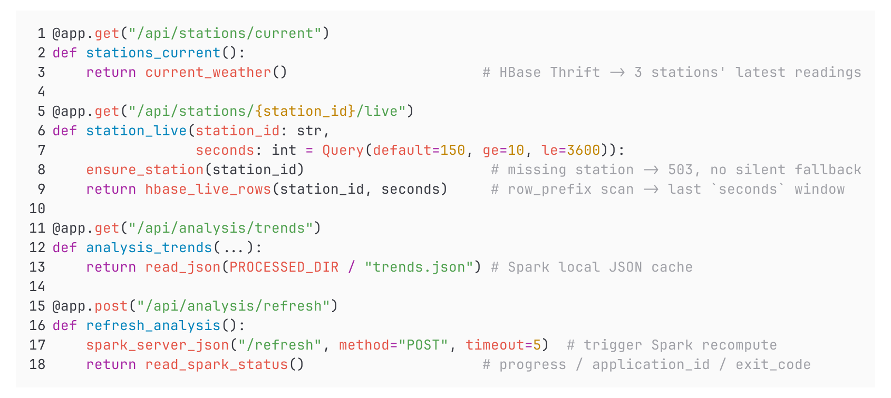

图 6-1 FastAPI 接口定义

前后端数据流如下图所示，三类接口分别对接不同数据源，前端三个页面按需调用：

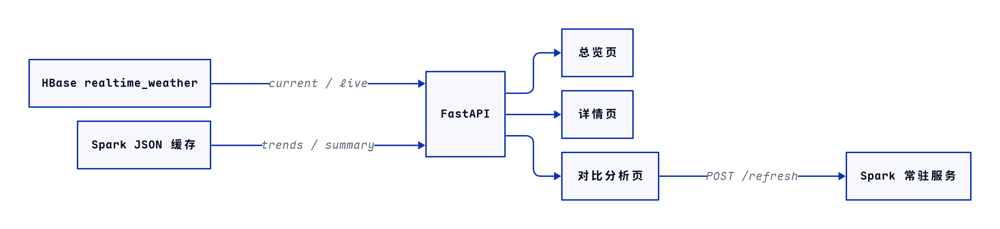

图 6-2 前后端数据流

完整接口清单见下表：

| 接口 | 用途 |
|---|---|
| `GET /api/stations/current` | 从 HBase 读取三站当前读数 |
| `GET /api/stations/{station_id}/live?seconds=150` | 从 HBase 读取站点最近实时序列 |
| `GET /api/analysis/trends` | 读取 Spark 历史趋势或窗口均值 |
| `GET /api/analysis/summary` | 读取 Spark 统计摘要 |
| `POST /api/analysis/refresh` | 触发 Spark 重算 |
| `GET /api/hdfs/records` | 读取 HDFS 实时批次记录 |

当前数据接口直接访问 HBase Thrift。若 HBase 当前表缺少某站点，接口返回服务不可用错误，不静默回退到旧缓存，避免页面展示过期实时数据。

### 6.2 Next.js 前端

前端包含总览、详情与对比分析三个页面：

| 页面 | 内容 |
|---|---|
| 总览 | 中国轮廓地图、三站点位、当前天气标签与五项指标 |
| 详情 | 站点选择、指标选择、HBase 最近 150 秒实时趋势、Spark 历史趋势 |
| 对比分析 | 三站同指标对比、Spark 统计摘要、HDFS 实时记录表与 Spark 手动刷新 |

总览页当前读数来自 HBase，天气标签由 `weather_code` 映射。详情页上半部分展示 HBase 实时趋势，下半部分展示 Spark 历史趋势，使同一页面同时体现短时实时变化与长期趋势。对比分析页将 Spark 结果用于多站比较与统计摘要展示，并以表格呈现 HDFS 实时批次记录。

前端每 1 秒刷新总览与详情数据，详情页实时曲线请求最近 150 秒 HBase 数据；对比分析页每 2 秒刷新 HDFS 实时记录表。三站历史对比图使用 Spark 生成的小时序列，记录表使用 HDFS 中的 `live_*.csv`，因此同一页面同时承载历史分析与实时写入两类数据。

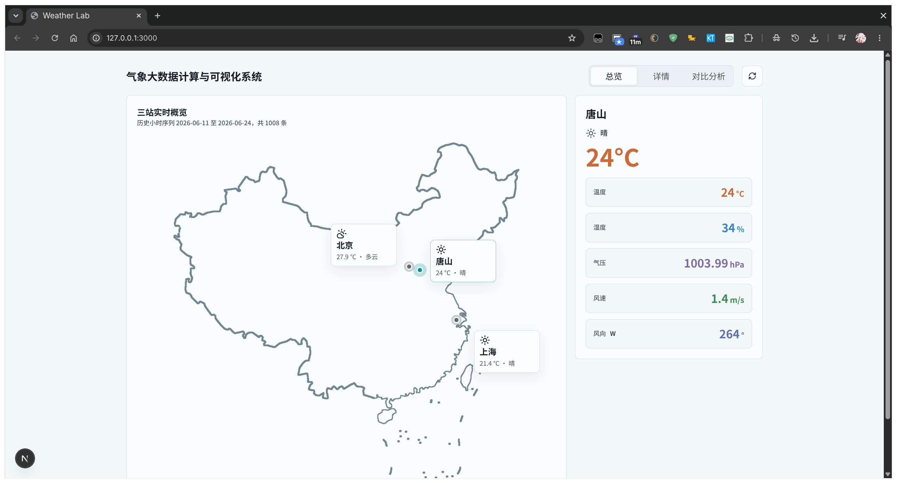

图 6-3 总览页：三站当前气象数据和站点分布

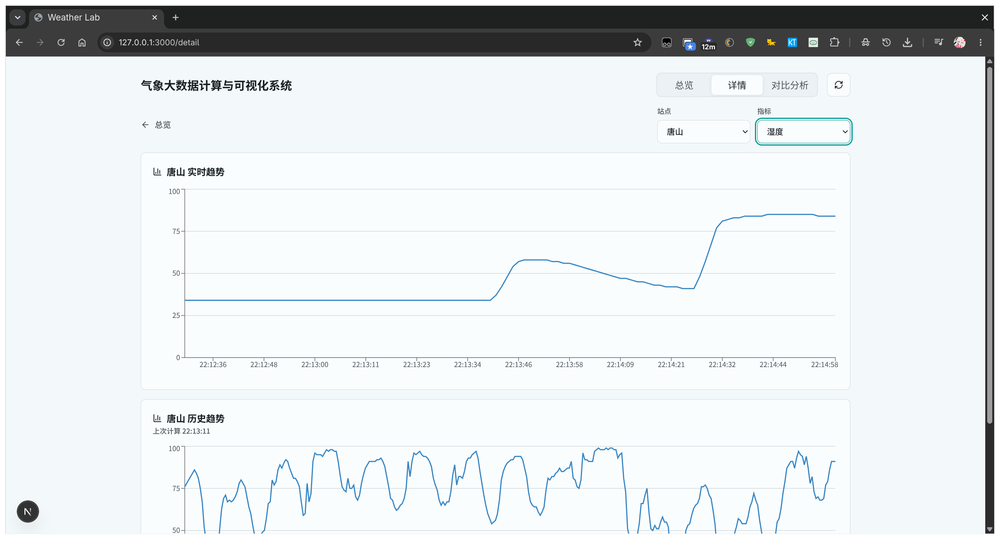

图 6-4 唐山详情页：DHT11 湿度扰动形成的两个实时波峰和历史趋势对照

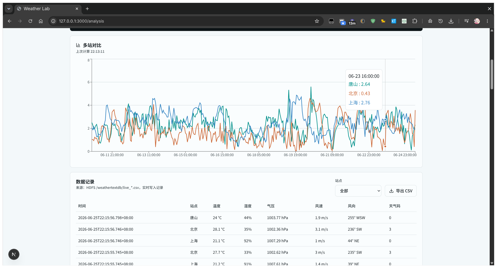

图 6-5 对比分析页：三站历史趋势对比和 HDFS 实时记录表

### 6.3 可视化方案的对应关系

本系统的可视化方案与基础方案对应关系如下：

| 基础方案 | 本系统方案 |
|---|---|
| MTAS Web 服务 | FastAPI |
| `/realdata` 实时数据 | `/api/stations/current`、`/api/stations/{station_id}/live` |
| `/meandata` 均值数据 | `/api/analysis/trends` |
| HTML/CSS/JS 静态页面 | Next.js 页面 |
| ECharts 图表 | Recharts 图表 |
| 手动运行 Spark 后页面更新 | 前端触发 Spark 刷新，旧缓存不中断展示 |

数据链路不变，仍由 HBase 提供实时数据，由 HDFS/Hive/Spark 提供统计数据；变化集中在 Web 服务与前端工程实现。

## 7. 系统集成与测试

系统集成按数据链路自底向上验证：先确认大数据组件与采集链路，再确认分析链路，最后确认 Web 层。各环节以实际运行日志与页面截图为验证依据。

### 7.1 启动流程验证

一键启动后，HDFS、YARN、HBase、采集服务、Open-Meteo 模拟站、Spark 分析服务、FastAPI 与 Next.js 依次就绪。`weather-dataserver`、`openmeteo-beijing`、`openmeteo-shanghai`、`spark-analysis-server` 与 `web` 五个应用服务均处于运行状态，8008、3000、8080、18081 端口分别对应 API、前端、采集服务与 Spark 服务，采集、存储与分析链路所需的后台进程同时启动。

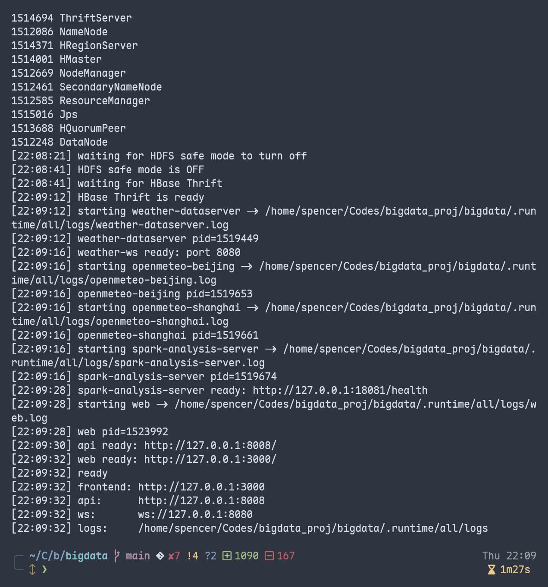

图 7-1 一键启动脚本运行结果

### 7.2 硬件采集验证

ESP32 板载程序使用 `DHT_PIN = 18`，与接线一致。串口日志中唐山站持续输出 `serial_json`，每条记录包含站点名、温度、湿度与连续增长的 `sample_seq`，随后通过 WebSocket 发送到采集服务器，证明唐山站真实硬件采集链路可用。

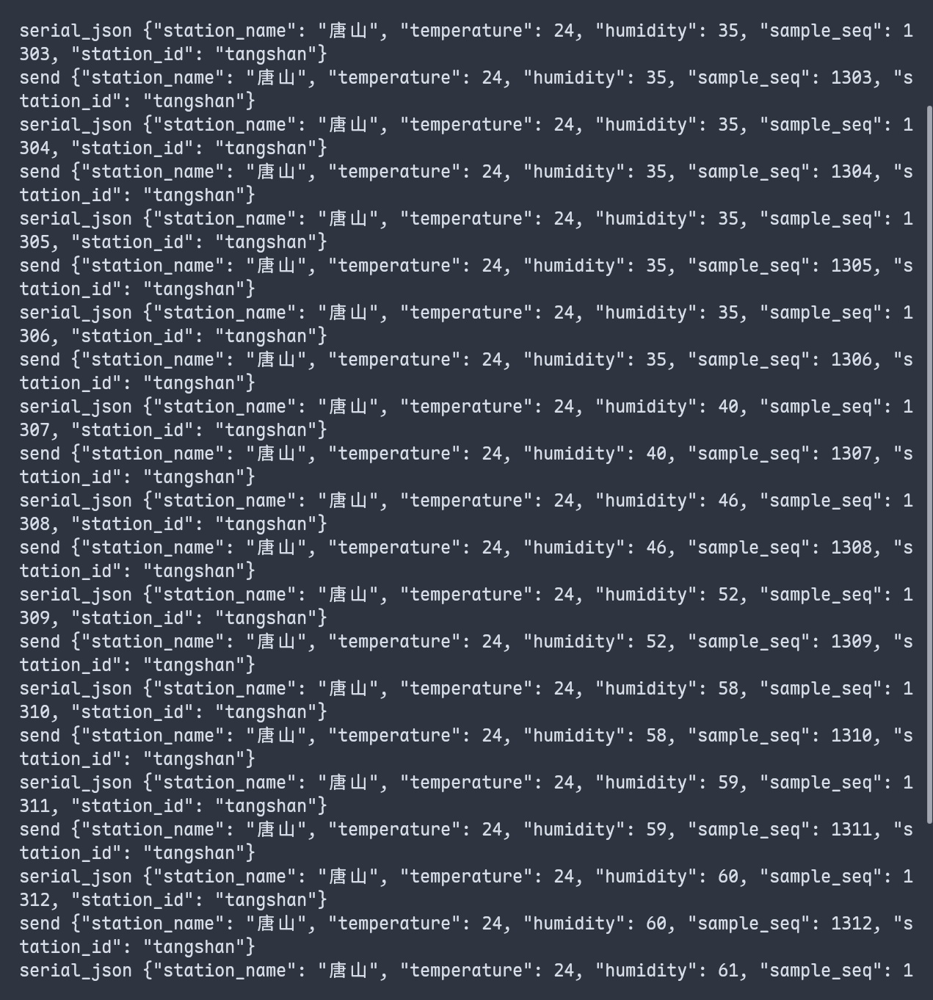

图 7-2 ESP32 串口实时日志：GPIO18 上的 DHT11 数据持续采集并发送

### 7.3 HDFS 与 Hive 验证

历史数据上传后，`/weathertextdb` 中可见 `weather_observations.csv`；Hive 建表后可对三站记录执行查询与统计，外部表同时覆盖历史主文件与实时批次文件。

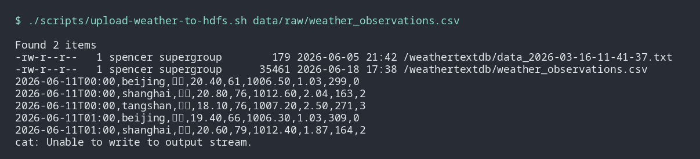

图 7-3 HDFS 上传验证截图

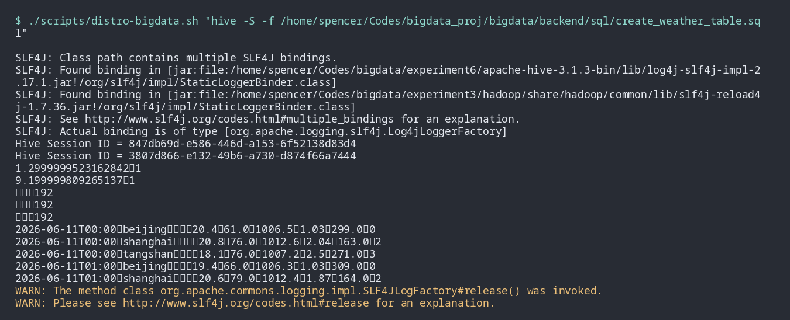

图 7-4 Hive 建表与查询截图

### 7.4 Spark 验证

Spark 任务在 YARN 上运行后生成 `/weather_analysis/*` 输出，包含站点摘要、日统计、小时序列与 10 秒窗口均值。

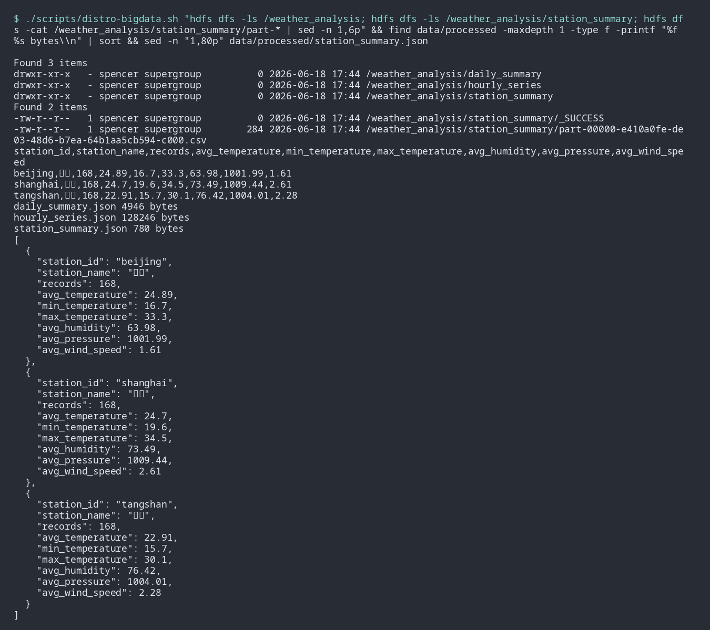

图 7-5 Spark 输出验证截图

对比分析页的“手动刷新”按钮经 FastAPI 调用 Spark 常驻服务触发重算，页面显示运行状态、YARN application id、进度条与日志尾部；运行期间旧分析结果保留展示。

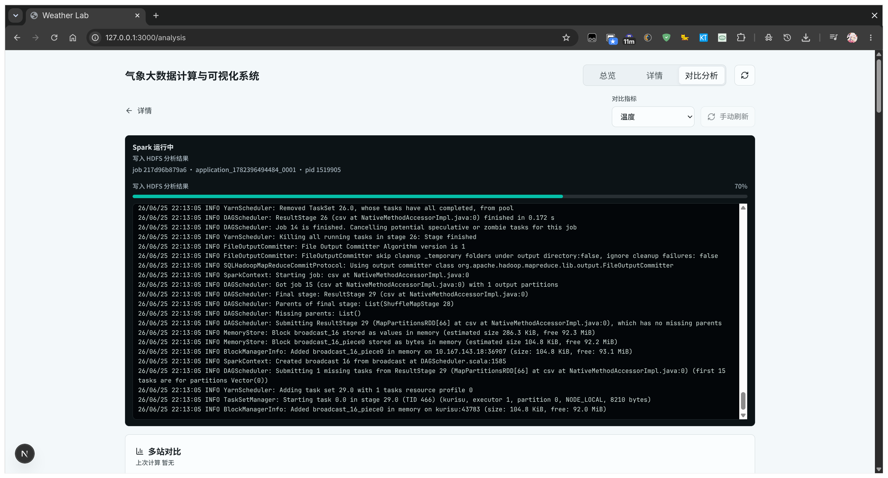

图 7-6 Spark 手动刷新运行中

刷新完成后页面显示 `Spark 重算完成`、进度 `100%`、`exit 0`。本次刷新复用同一个 YARN application `application_1782395459252_0001`，总耗时约 41.96 秒；日志尾部输出 `historical_records=1008`、`all_valid_records=23235`、`station_summary_rows=3`、`daily_summary_rows=42`、`hourly_series_rows=1008`、`window_mean_rows=1425`，与历史小时数据量、实时批次规模一致。

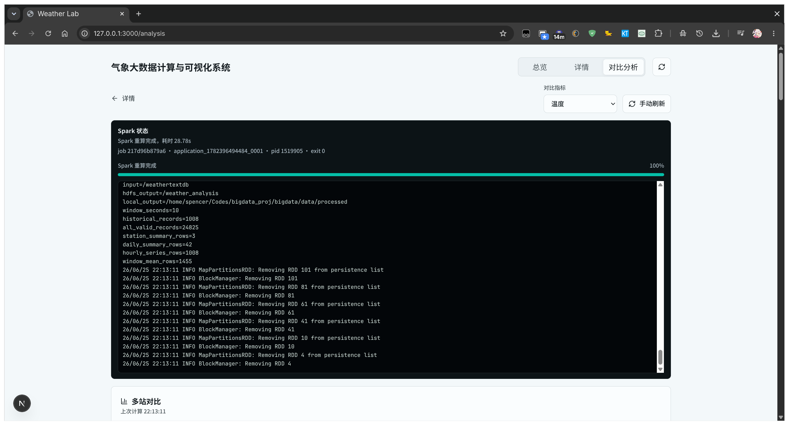

图 7-7 Spark 手动刷新完成态

### 7.5 Web 与接口验证

总览页展示三站当前读数；详情页选择唐山与湿度指标后，可见两个湿度波峰，由靠近 DHT11 呼气导致局部湿度短时升高所致，曲线随后回落，符合传感器读数变化规律；对比分析页同时展示三站历史趋势与实时刷新的 HDFS 记录表，记录表每 2 秒刷新，三站记录持续追加，HDFS 实时批次写入与前端读取同步工作。

主要验收结论如下：

| 验证项 | 结果 |
|---|---|
| 历史小时数据 | 1008 条，三站各 336 条 |
| HBase 当前表 | `realtime_weather` 保存三站短期实时数据 |
| HDFS 原始目录 | `/weathertextdb` 保存历史主文件与实时批次文件 |
| Hive 表 | `weather_table` 可查询与统计 |
| Spark 输出 | `summary`、`daily_summary`、`hourly_series`、`window_mean` 均已生成 |
| FastAPI | 当前数据、趋势、摘要与批次记录接口可访问 |
| 前端页面 | 总览、详情、对比分析三页均可展示实际数据 |

## 8. 改进与加分项说明

本系统在基础要求之上做了以下改进。

### 8.1 自动气象站核心板升级

自动气象站核心板由 ESP32-C3 改为 ESP32-WROVER-E，在面包板上搭接，获得更高的处理性能与更充裕的内存，保障 MicroPython 采样与 WebSocket 发送的稳定性。

### 8.2 ESP32 接入方式调整

ESP32 由 TCP Server 改为 WebSocket Client，主动连接采集服务器。相比由服务器反向连接站点的方式，主动推送不依赖站点的实时 IP，热点分配地址变化时仍可接入；三站接入协议统一，采集服务器按同一套逻辑解析与写入。

### 8.3 HBase 写入方式优化

采集服务改用 HappyBase Thrift 直接批量写入，仅在启动时确保表存在，运行时按记录写入 HBase，避免逐批调用 `hbase shell` 与反复建表、扫描拖慢实时采集。

### 8.4 Spark 分析扩展与自动执行

Spark 分析在 10 秒窗口均值基础上增加站点摘要、日统计、小时序列、气压变化量、最大风速与主导风向；主导风向采用向量平均，避免普通平均对环形角度不适用的问题。Spark 分析由常驻服务托管，前端可手动触发重算并展示进度；服务复用同一个 YARN application，避免反复提交作业带来的资源开销，实现数据处理自动执行与防止反复执行。

### 8.5 Web 层替换

以 FastAPI 替代 MTAS，以 Next.js + Recharts 替代 HTML/CSS/JS + ECharts，接口结构化、页面拆分为总览/详情/对比分析三页，并支持前端触发 Spark 重算。数据来源仍为 HBase、HDFS、Hive 与 Spark，数据链路不变。

### 8.6 实时记录表 key 稳定性

HDFS 批次记录中可能出现同一站点同一采集时间的多条记录，单独使用 `station_id + collect_time` 作为表格行 key 不够稳定。实时记录表改用 `station_id + collect_time + sample_seq + index` 的组合 key，在频繁刷新时保持组件身份稳定，避免行被重复或遗漏。

## 9. 结论

本系统完成了气象数据采集、传输、存储、处理与可视化的完整流程。唐山站由 ESP32-WROVER-E 与 DHT11 采集真实温湿度，北京、上海以 Open-Meteo 当前数据加扰动形成对比站；三站经 WebSocket 推送至采集服务器，并行写入 HBase 与 HDFS。HBase 承担短期实时查询，HDFS 承担批量存储；Hive 在 HDFS 上建立外部表，Spark on YARN 完成站点统计、日统计、小时序列与 10 秒窗口均值；FastAPI 与 Next.js 将实时数据与分析结果呈现于浏览器。

系统覆盖了 ESP32-WROVER-E、DHT11、Wi-Fi 传输、HDFS、HBase、Hive、Spark on YARN 与 Web 可视化等关键组件，并在实时接入、Open-Meteo 数据来源、Spark 分析内容与前端展示方式上做了改进。剩余限制包括 DHT11 精度有限、热点分配 IP 可能变化、北京与上海站仍属软件模拟站、Open-Meteo 数据获取依赖网络。后续可加入更多实物气象站、采用更高精度传感器，并将 Spark 分析调度进一步自动化。

## 致谢

感谢指导教师提供课程设计要求和实验指导文档，也感谢课程前序实验中对 Hadoop、HBase、Hive 和 Spark 的环境准备，为本次系统集成提供了基础。

## 心得体会

通过本次课程设计，我对气象大数据系统的端到端流程有了更完整的理解。单个组件本身并不复杂，但把传感器、网络、HDFS、HBase、Hive、Spark 和 Web 页面串联起来后，数据格式、启动顺序、端口占用和运行环境都会影响最终结果。调试过程中，ESP32 网络连接、HBase Thrift、YARN 配置和前端接口都需要逐步验证。最终系统能够从实物传感器采集数据，并在网页中展示实时趋势和历史分析结果，说明大数据组件之间的分工和协作已经被完整打通。

## 参考文献

[1] 《大数据计算与可视化》课程设计指导文档：气象大数据采集、分析与可视化系统。

[2] Apache Hadoop Documentation. https://hadoop.apache.org/

[3] Apache HBase Reference Guide. https://hbase.apache.org/

[4] Apache Hive Documentation. https://hive.apache.org/

[5] Apache Spark Documentation. https://spark.apache.org/docs/latest/

[6] FastAPI Documentation. https://fastapi.tiangolo.com/

[7] Next.js Documentation. https://nextjs.org/docs

[8] Open-Meteo API Documentation. https://open-meteo.com/

## 附录

### 附录 A 默认端口分配

| 服务 | 默认端口 | 说明 |
|---|---:|---|
| FastAPI | 8008 | REST API |
| Next.js | 3000 | 前端页面 |
| 采集 WebSocket Server | 8080 | 接收三站推送 |
| Spark 分析常驻服务 | 18081 | 触发并监控 Spark 重算 |
| HBase Thrift | 9090 | HappyBase 读写入口 |
| HDFS NameNode Web | 9870 | HDFS 状态页 |
| HBase Master Web | 16010 | HBase 状态页 |

### 附录 B 主要脚本清单

| 脚本 | 用途 |
|---|---|
| `scripts/start-all.sh` | 一键启动/停止/重启/状态检查 |
| `scripts/upload-weather-to-hdfs.sh` | 上传历史 CSV 至 HDFS |
| `scripts/run-spark-analysis-yarn.sh` | 在 YARN 上运行 Spark 分析 |
| `scripts/upload-esp32-weatherstation.sh` | 烧录 ESP32 气象站程序 |
| `backend/scripts/weather_dataserver.py` | WebSocket 采集服务器 |
| `backend/scripts/openmeteo_station_client.py` | Open-Meteo 模拟站客户端 |
| `backend/scripts/spark_weather_analysis.py` | Spark 分析主程序 |
| `backend/sql/create_weather_table.sql` | Hive 外部表建表脚本 |

### 附录 C 关键运行参数

| 参数 | 默认值 | 说明 |
|---|---|---|
| `FLUSH_SIZE` | 30 | HDFS 实时批次写入条数阈值 |
| HBase `realtime_weather` TTL | 150 秒 | 实时数据存活时间 |
| 前端总览/详情刷新间隔 | 1 秒 | 实时数据轮询 |
| 对比分析 HDFS 记录表刷新间隔 | 2 秒 | 实时批次表轮询 |
| Spark 分析窗口 | 10 秒 | 窗口均值聚合粒度 |
| `RUN_SPARK_ON_START` | 0 | 启动时是否自动触发一次 Spark 重算 |
