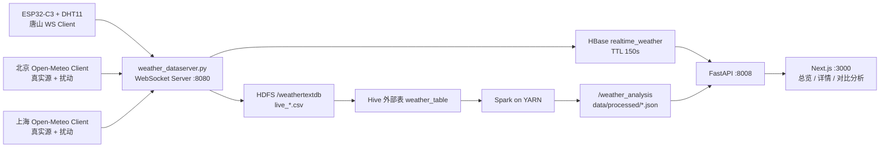

# 气象大数据采集、分析与可视化系统课程设计报告

## 1. 项目概述

本课程设计实现一个面向唐山、北京、上海三站的气象大数据采集、存储、分析与可视化系统。系统保留课程要求中的 HDFS、HBase、Hive、Spark 链路，并使用 FastAPI 与 Next.js 提供接口和前端面板。

本次修正后的核心目标是让真实链路完整跑通：ESP32-C3 通过 Wi-Fi 接入热点，以 WebSocket Client 方式每秒推送唐山 DHT11 温湿度；采集服务器补齐 Open-Meteo 当前气压、风速、风向和天气码，并并行写入 HBase 与 HDFS；北京、上海由主机上的 Open-Meteo WebSocket Client 按同样协议每秒推送；FastAPI 直接读取 HBase 当前表和 Spark 结果，前端展示总览、详情、对比分析三页。

## 2. 需求与修正点落实

本次修正依据 `设计修正记录.md` 逐项完成，主要落实如下。

| 修正项 | 落实情况 |
|---|---|
| HBase 当前链路 | FastAPI 当前数据直接读取 HBase Thrift；不再静默回退到本地 JSON |
| 三站统一采集 | 唐山 ESP32、北京模拟站、上海模拟站均作为 WebSocket Client 接入采集服务器 |
| Open-Meteo 扰动 | 风速、风向、天气码与温度、湿度、气压一样使用 Open-Meteo 当前真实源；连续字段加小幅扰动 |
| 前端统一模型 | 移除 ESP32 特殊面板与 source 标签，三站使用统一卡片和详情页 |
| 三页布局 | 实现总览、详情、对比分析三页 |
| Spark 分析补充 | 增加气压变化量、最大风速、主导风向；主导风向使用向量平均 |
| 运行流程 | HDFS、YARN、HBase、Hive、采集 WS Server、两路模拟站、ESP32、FastAPI、Next.js 均已实际启动验证 |

## 3. 系统架构

系统分为实时采集链路、历史存储分析链路和 Web 可视化链路。



### 3.1 实时链路

唐山站使用 ESP32-C3 与 DHT11 读取温度、湿度，设备连接热点 `prometheus`，获得地址 `10.167.143.75`，以 WebSocket 连接主机 `10.167.143.18:8080`。北京、上海使用 `openmeteo_station_client.py`，从 Open-Meteo 当前天气接口获取真实基准值，再按小幅扰动生成每秒记录。三个站统一发送 JSON，字段包括：

```json
{
  "station_id": "tangshan",
  "station_name": "唐山",
  "temperature": 24,
  "humidity": 36,
  "sample_seq": 137
}
```

采集服务器对缺失字段进行补齐：气压、风速、风向和天气码来自对应站点 Open-Meteo 当前值。风速扰动范围约为 ±0.5 m/s，风向扰动范围约为 ±5 度，天气码保留当前真实天气码。

### 3.2 HBase 链路

实时数据写入 HBase 表 `realtime_weather`，列族为 `data`，TTL 为 150 秒。行键采用：

```text
<station_id>_<collect_time_compact>
```

FastAPI 的 `/api/stations/current` 和 `/api/stations/{station_id}/live` 均从 HBase Thrift 读取，不再依赖本地 JSON 回退。实测当前接口返回三站实时值：

```text
唐山 2026-06-25T18:11:17.085+08:00 25.0°C 36.0% 风速 2.27m/s 风向 258.69°
北京 2026-06-25T18:11:18.134+08:00 31.81°C 27.81% 风速 1.18m/s 风向 130.08°
上海 2026-06-25T18:11:17.203+08:00 24.38°C 72.82% 风速 2.56m/s 风向 61.43°
```

### 3.3 HDFS、Hive 与 Spark 链路

离线两周数据由 Open-Meteo 拉取，范围为 `2026-06-11T00:00` 到 `2026-06-24T23:00`，共 1008 条，三站各 336 条。数据上传到 HDFS `/weathertextdb/weather_observations.csv`。实时采集服务继续向同一目录写入 `live_*.csv` 批次文件。

Hive 外部表 `weather_table` 直接引用 `/weathertextdb`。Spark 使用：

```bash
spark-submit --master yarn backend/scripts/spark_weather_analysis.py /weathertextdb /weather_analysis data/processed --source hive --hive-table weather_table
```

本次修正解决了 Hive/Spark 看似“很慢”的根因：运行时配置曾让客户端连接 `0.0.0.0:8032`，并且 YARN daemon 启动方式在当前容器环境中失败。修复后 `yarn node -list` 连接 `localhost:8032`，可看到一个 RUNNING NodeManager；Hive 聚合查询能正常启动 MapReduce 作业，Spark on YARN 也能成功提交并完成。

## 4. 关键实现

### 4.1 ESP32 无线采集

ESP32 程序位于 `esp32/weatherstation_main.py`。程序启动后连接 Wi-Fi，读取 DHT11，并建立 WebSocket：

```text
wifi connected ip=10.167.143.75
weather station ws client station=唐山 server=10.167.143.18:8080 dht_pin=4
websocket tcp connected
websocket connected 10.167.143.18:8080
send {"station_name": "唐山", "temperature": 24, "humidity": 36, "sample_seq": 137, "station_id": "tangshan"}
```

网络问题定位结果：热点 `prometheus` 下电脑与 ESP32 同在 `10.167.143.0/24`，电脑能 ping 通 ESP32，说明热点没有客户端隔离。ESP32 起初连接 `10.167.143.18:8080` 超时，是本机 UFW 拦截入站 TCP；放行 `wlan0` 上 `10.167.143.0/24 -> 8080/tcp` 后，ESP32 通过无线链路完成 WebSocket 握手并持续推送。

服务器侧使用 `websockets.serve(..., ping_interval=None)`。原因是 MicroPython 端实现的是极简 WebSocket Client，不处理服务端 ping/pong；关闭服务端 keepalive ping 后可以保持长连接，不再因 ping timeout 断开。

### 4.2 采集服务器

`backend/scripts/weather_dataserver.py` 改为 WebSocket Server，统一接收三站推送。为避免每秒数据被 HDFS/HBase 写入阻塞，服务器把接收消息与刷盘解耦：

- WebSocket handler 只解析、补齐、入队；
- 后台单 worker 串行刷新批次；
- HBase 使用 HappyBase Thrift 批量 `put`，不再每批调用 `hbase shell create/alter/scan`；
- HDFS 继续按小批次写入 `/weathertextdb/live_*.csv`。

服务端实测日志显示三站同时在线：

```text
station websocket connected peer=('10.167.143.75', 51938) path=/
record 2026-06-25T18:10:47.223+08:00 唐山 temp=24.0 humidity=36.0
record 2026-06-25T18:10:48.103+08:00 北京 temp=31.48 humidity=27.16
record 2026-06-25T18:10:48.175+08:00 上海 temp=24.31 humidity=73.67
```

### 4.3 Spark 分析

Spark 分析输出三个 JSON 文件：

- `data/processed/station_summary.json`
- `data/processed/daily_summary.json`
- `data/processed/hourly_series.json`

统计摘要增加了 `pressure_delta`、`max_wind_speed`、`dominant_wind_direction`。风向不是直接做算术平均，而是转为正弦、余弦分量后计算向量平均，避免 359 度与 1 度被错误平均为 180 度。

本次 Spark 输出摘要如下：

| 站点 | 记录数 | 均温 | 均湿 | 气压变化量 | 最大风速 | 主导风向 |
|---|---:|---:|---:|---:|---:|---:|
| 北京 | 768 | 28.81 | 41.69 | 11.7 | 4.58 | 114.83 |
| 上海 | 833 | 24.72 | 75.58 | 13.3 | 5.01 | 61.45 |
| 唐山 | 472 | 23.44 | 62.23 | 10.0 | 5.61 | 210.67 |

## 5. 前端可视化

前端使用 Next.js，分为三个页面：

- 总览：地图与统一站点卡片，显示三站当前读数；
- 详情：站点选择器、指标选择器、HBase 最近 150 秒实时趋势、Spark 历史趋势；
- 对比分析：多站指标对比、统计摘要、原始记录表和 CSV 导出。

总览页当前读数来自 HBase，天气标签由 HBase 中的 `weather_code` 映射。详情页实时趋势来自 `/api/stations/{station_id}/live`，历史趋势来自 Spark 预计算 JSON。对比分析页可手动触发 Spark 刷新，刷新过程保留旧缓存数据展示。

### 5.1 运行截图


## 6. 实际运行与验证

### 6.1 服务启动顺序

实际运行顺序如下：

1. 启动 HDFS；
2. 启动 YARN ResourceManager 与 NodeManager；
3. 启动 HBase、HBase Thrift；
4. 创建 Hive 外部表；
5. 启动采集服务器 WebSocket Server；
6. 启动北京 Open-Meteo WebSocket Client；
7. 启动上海 Open-Meteo WebSocket Client；
8. ESP32 上电并通过 Wi-Fi 连接；
9. 启动 FastAPI；
10. 启动 Next.js。

### 6.2 数据验证结果

| 验证项 | 结果 |
|---|---|
| ESP32 无线连接 | `10.167.143.75 -> 10.167.143.18:8080` WebSocket 握手成功 |
| HBase 当前表 | `/api/stations/current` 返回唐山、北京、上海三站 |
| HDFS 原始目录 | `/weathertextdb` 包含历史主文件与实时 `live_*.csv`，实测 398 个文件 |
| Hive 查询 | `weather_table` 可对三站记录分组统计 |
| Spark on YARN | 成功连接 `localhost:8032`，任务 exitCode 0 |
| 前端构建 | `bun run build` 成功 |
| 前端页面 | 总览、详情、对比分析均能加载实际数据 |

### 6.3 关键命令

```bash
./scripts/start-bigdata-services.sh
python3 backend/scripts/fetch_open_meteo.py data/raw --days 14
./scripts/upload-weather-to-hdfs.sh data/raw/weather_observations.csv
./scripts/create-hive-weather-table.sh
./scripts/run-spark-analysis-yarn.sh
uv run --with websockets --with happybase python backend/scripts/weather_dataserver.py --flush-size 3
uv run --with websockets python backend/scripts/openmeteo_station_client.py beijing --ws-url ws://127.0.0.1:8080
uv run --with websockets python backend/scripts/openmeteo_station_client.py shanghai --ws-url ws://127.0.0.1:8080
ESP32_SSID=prometheus ESP32_WIFI_KEY=abcdefgh ESP32_SERVER_HOST=10.167.143.18 ESP32_SERVER_PORT=8080 ./scripts/upload-esp32-weatherstation.sh
./scripts/run-web.sh
```

## 7. 问题定位与修复记录

### 7.1 Hive 运行慢

现象是 Hive/Spark 作业启动时间异常，初看像性能不足。实际定位发现：

- YARN 客户端连接到了 `0.0.0.0:8032`；
- ResourceManager 没有稳定启动；
- `spark-env.sh` 与 Hadoop 配置目录不一致；
- 当前 distrobox 环境下 `yarn --daemon` 启动方式受 `renice` 限制影响。

修复方式：

- 生成项目内 `.runtime/hadoop-conf`、`.runtime/hbase-conf`、`.runtime/spark-conf`；
- 强制 `yarn.resourcemanager.address=localhost:8032`；
- `distro-bigdata.sh` 统一使用 runtime conf；
- `start-bigdata-services.sh` 用 `nohup yarn resourcemanager` 和 `nohup yarn nodemanager` 启动；
- HBase ZooKeeper admin port 改为 18080，避免占用采集服务的 8080。

修复后，Hive 查询能正常启动 MapReduce 作业，Spark on YARN 能成功提交并完成。

### 7.2 ESP32 无线连接

ESP32 初始现象为 TCP connect timeout。定位步骤：

- 电脑 wlan0 为 `10.167.143.18/24`；
- ESP32 为 `10.167.143.75`；
- 网关为 `10.167.143.240`；
- 电脑可 ping 通 ESP32，排除热点客户端隔离；
- 换 18081 端口测试也超时，排除 WebSocket 服务本身；
- 发现 `ufw` active，放行 `wlan0` 入站 8080 后握手成功。

结论：热点拓扑可用，问题为主机防火墙入站策略。

### 7.3 实时写入阻塞

旧方案每批调用 `hbase shell`，并且每次都执行 `create/alter/scan`，会拖慢采集服务器。修复后改为 HappyBase Thrift 直写，同时 HDFS 写入进入后台队列，WebSocket 接收不被阻塞。

## 8. 总结

本系统已经完成从 ESP32 无线采集到 HBase/HDFS 双写、Hive 建表、Spark on YARN 分析、FastAPI 接口和 Next.js 前端展示的真实链路。唐山站由 ESP32-C3 + DHT11 提供真实温湿度，北京和上海由 Open-Meteo 真实源加扰动模拟同频采集，三站均通过 WebSocket 每秒接入采集服务器。历史侧完成两周数据采集与 HDFS 入库，Spark 汇总结果已补充气压变化量、最大风速和向量平均主导风向。前端三页已接通实际 API，并通过截图留存运行证据。
